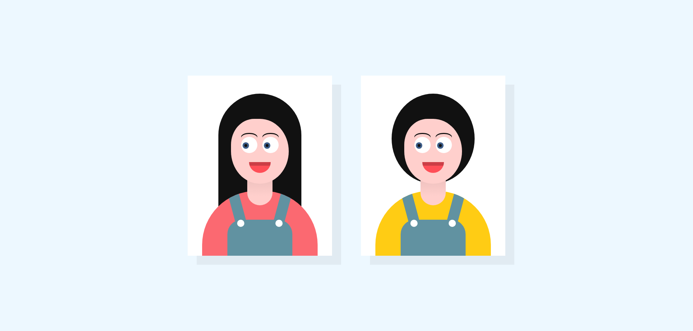

# Duas personagens com olhos que seguem o cursor do mouse enquanto ele se mexe

 
 
 - Olhos de personagens seguem o cursor do mouse enquanto você o mexe

 - Projeto construído durante o curso PROPROFISSÃO.

## Acesso
 [Clique aqui para acessar! :)](https://github.com/GuilhermeSK2/Eyes-Follow-Mouse-Cursor)

## Tecnologias

- HTML
- CSS
- Git e Github

## Contato
[(LinkedIn)](https://www.linkedin.com/in/guilherme-freitas-9901a220b/)
-----
guilhermefsantos150@gmail.com
